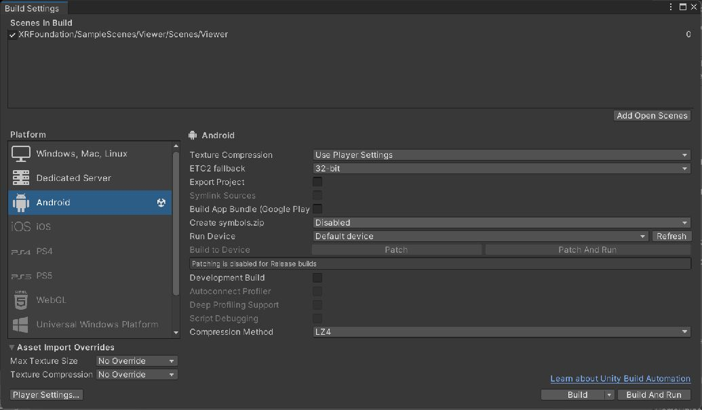

# SiNGRAY G2 Native SDK: Demo and User Guide

This guide covers the `dev/4.2` Unity project, its sample applications, and the workflow for building and running applications on SiNGRAY G2 devices. The configured product version is `4.2.0-dev.1`, a development build. Hardware behavior must be verified on the target device and firmware.

For application interfaces, settings, events, and examples, see the [API Reference](API-Reference.md).

## 1. Development environment

| Component | Project configuration |
| --- | --- |
| Unity Editor | `2022.3.62f3` |
| Build target | Android |
| Scripting backend | IL2CPP |
| CPU architecture | ARM64 |
| Minimum Android API | 30 |
| Target Android API | 35 |
| Android application identifier | `com.singray.SDK` |
| MRTK packages | 2.8.3, provided as local package archives |
| Large binary storage | Git LFS for `.aar` and `.tgz` files |

Install Android Build Support and the corresponding SDK, NDK, and OpenJDK through the Unity installation workflow. Use the recorded Editor version where available; validate any substitute version before adopting it for device builds. Git must be available for the Git-based package dependency in `Packages/manifest.json`.

The editor version is recorded in `ProjectSettings/ProjectVersion.txt`; the package lock uses the `packages.unity.com` registry. This branch remains on Unity 2022, not Unity 6. Changing the Unity Hub language does not migrate a project or validate native SDK compatibility.

## 2. Obtain the project

With Git and Git LFS installed, run:

```sh
git lfs install
git clone --branch dev/4.2 git@github.com:HMS-Unity/SiNGRAY_G2_NativeSDK.git
cd SiNGRAY_G2_NativeSDK
git lfs pull
git lfs fsck
```

The SSH command requires a GitHub SSH key configured for your account. HTTPS can also be used with the same repository and branch.

Open the repository root in Unity Hub. Wait for package resolution and asset import to complete before opening a scene or building. The MRTK archives under `Packages/MixedReality` must be actual binary files, not small text files containing LFS pointers.

Keep an AAR and its `.meta` file together when replacing a native library. The metadata preserves Unity asset identity and Android import settings. Do not infer the native SDK version from the Unity application version: these are separate version identifiers.

## 3. Choose a demo entry point

Scene paths below are relative to `Assets/XRFoundation/SampleScenes/`.

| Entry point | Scene path | Purpose |
| --- | --- | --- |
| Camera Viewer | `Viewer/Scenes/Viewer.unity` | Camera and sensor stream controls; the currently enabled build scene |
| Sensor diagnostics | `Viewer/Scenes/Sensor.unity` | Sensor inspection and calibration-related controls |
| SDK Samples Hub | `SDKSampleHub/Scenes/SDKSamples.unity` | Categorized navigation across feature modules |
| MRTK2 | `MRTK2/Scenes/MRTK2.unity` | Mixed reality interaction example |

The checked-in Build Settings currently contain only the Camera Viewer scene. To launch another entry point, open **File > Build Settings**, add that scene, and place it first among enabled scenes. Opening a scene in the Editor does not automatically change the scene launched by a previously built APK.

### SDK Samples Hub

The hub keeps a shared XR rig and instantiates feature module prefabs. Select a category, then a sample. Use the Home action to leave the active sample; Escape or Backspace also returns home when a sample is active. Where the left-hand menu is available, its controls include Samples, Home, Hide, and MR Recording.

The hub provides the following modules:

| Category | Modules | Suggested verification |
| --- | --- | --- |
| Sensors & Cameras | Camera Viewer, RGBD, ToF Point Cloud, MR Video Capture | Start one feature, inspect its output, and stop it before switching |
| Spatial Understanding | Plane Detection, Spatial Map, Spatial Mesh, Tag Recognizer | Use a textured environment and the appropriate marker or map data |
| Interaction | Keyboard, Static Gesture, MRTK2 | Verify text entry, gestures, hand rays, and UI selection on hardware |
| Media & System | Media Recorder, RTSP Streamer, System Settings | Verify recording output, network streaming, and device settings |

Additional feature scenes exist under the sample folders, including eye tracking, joystick, Bluetooth, Wi-Fi, and speech examples. Their presence does not guarantee support on every G2 hardware or firmware configuration.

The Editor command **Singray > XR > SDK Samples > Rebuild Hub Scene** regenerates the hub and related assets. Use it when intentionally rebuilding the hub; save scene changes first. It is not required for a normal build of the checked-in hub.

## 4. Build and install



Actual Editor screenshot, October 7, 2026. The image illustrates scene selection and the Android target only. It does not show a successful build or sensor output from a device.

1. Switch the active platform to Android in Build Settings.
2. Confirm the entry scene and enabled scene order.
3. Check Player Settings against the configuration table above.
4. Connect the G2 device, enable USB debugging, and accept its computer authorization prompt.
5. Use **Build And Run**, or build an APK and install it with ADB.

```sh
adb devices
adb install -r path/to/SiNGRAY-G2.apk
adb shell monkey -p com.singray.SDK -c android.intent.category.LAUNCHER 1
```

Launch the application on the device and grant requested permissions needed by the selected feature. If installation reports an incompatible signing certificate, use the same signing configuration as the installed application or deliberately remove that installation after preserving its data.

## 5. Use the sensor demos

### Camera preview

Start a single stream from the Viewer controls and confirm that its image changes with the physical scene. Available stream interfaces include RGB, ToF depth, ToF infrared, left and right tracking cameras, and the compute camera. Actual availability depends on the device.

Start with the configured RGB default of 1280 x 720 at 30 FPS and ToF QVGA at 30 FPS. The API exposes additional modes, but a mode must be supported by the connected hardware. Stop an active stream before changing settings and restarting it.

### RGBD and point clouds

Use the RGBD sample to exercise RGB pixel-to-3D queries. Queries use image pixel coordinates, not Unity screen coordinates; convert UI coordinates to the camera image dimensions first. Treat a failed query as unavailable data rather than a valid origin point.

Use the ToF Point Cloud sample to inspect depth-derived geometry. Allow time for the first data frame and validate scale and orientation against a known scene. Display textures are previews and should not be treated as raw metric depth measurements.

The RGBD demo creates a world-space preview panel when no `RawImage` is assigned. An empty panel does not prove that RGB frames or depth data are available. Its manager waits up to ten seconds for SDK readiness and rejects pixel-pose queries before a valid frame timestamp is available.

Starting the ToF Point Cloud demo now enables its drawing loop directly; pressing the Up Arrow key is no longer required to enable drawing. Pending native startup is cancelled when stopped. Leave the sample through Home and reopen it to verify repeated startup and cleanup.

### Calibration diagnostics

The `XvSensorCalibrationDump` component provides RGB, ToF, and stereo dump actions. Start the corresponding stream and wait for frames before requesting calibration. The component includes readiness checks and an eight-second default timeout. Its output is written to a text file; use the reported output path to retrieve it.

Do not call low-level calibration reads before sensor initialization. The native implementation can fail outside the scope of managed exception handling.

## 6. Spatial, interaction, and media demos

**Spatial understanding:** Start the selected detection feature and inspect its visual output. For maps, save a map and use its returned path when loading it again. Observe completion events and the sample status rather than assuming that a save or load call completes immediately. Marker recognition requires the selected recognizer mode and suitable target data.

**MRTK2 interaction:** Use the supplied rig and configured input providers. Verify near interaction, hand rays, and UI activation independently on the device. Avoid adding a second XR rig or EventSystem when incorporating a sample into another scene.

**Recording:** Start capture, wait for a camera frame, then record. Stop recording and wait for the completion callback or the hub's saved-path status before leaving the application. In the hub, MR Recording toggles recording and reports its output path after saving.

**RTSP:** Configure the sample's streaming settings for your network and receiving client before starting. Verify connectivity separately from camera capture.

**System settings:** Test brightness, volume, and other supported settings on the device. The product-level brightness API clamps requests to levels 1 through 9.

## 7. Integrate the SDK into an application

Use `Singray.G2.SingrayG2Manager` for the product-facing camera, point-cloud, RGBD, IMU, event, and brightness interfaces. Use the Foundation feature managers for functionality beyond that facade, following the matching sample's Inspector configuration and lifecycle.

1. Start from a working sample scene with its XR rig and input configuration.
2. Resolve `SingrayG2Manager.Instance` from a Unity lifecycle method on the main thread.
3. Wait for `IsSdkReady` before requesting native data.
4. Apply sensor settings, subscribe to events, and start the required stream.
5. Process data without retaining backend-owned textures or buffers as immutable snapshots.
6. Unsubscribe and stop the features your component owns when it is disabled.

The manager can persist across scene changes. Coordinate stream ownership across consumers so that one component does not stop a stream still required by another.

## 8. Editor simulation and device verification

`Auto` mode uses simulation in the Unity Editor and non-Android players, and the native backend in an Android player. Simulation applies to the `Singray.G2` facade; legacy Foundation samples that call native APIs directly are not automatically simulated.

Synthetic RGB previews use 512 x 288 textures, while simulated ToF previews use 320 x 240 textures. Frame metadata can describe a different configured resolution. Simulation is useful for UI wiring, lifecycle handling, and application flow. It does not establish native library compatibility, calibration accuracy, tracking quality, or device performance.

For each release candidate, record the device and firmware, APK version, native library hashes, and results for startup, stream start/stop, scene transitions, interaction, and recording. Repeat device testing after replacing an AAR.

### Device regression checklist

The following failures were reported for `SDKSamples`. Code corrections are included, but all hardware results below remain **pending**. Managed compilation and parser checks cannot validate native frame delivery or rule out a native crash.

| Sample | Test procedure | Expected result | Hardware status |
| --- | --- | --- | --- |
| RGBD | Open the module; start its capture controls; move the device and query an image pixel | Live RGB preview and valid pixel-to-3D results when supported data is available | Pending |
| ToF Point Cloud | Start the module's point-cloud controls without keyboard input; view nearby geometry; stop and restart | Visible, updating points with plausible scale and orientation | Pending |
| Plane Detection | Start detection facing a textured planar surface; return Home and repeat | Responsive UI, detected planes when supported, and no crash | Pending |
| Spatial Map | Start scanning; toggle feature points; save, await completion, then load the saved path | No crash; valid map file and completion events; feature points when available | Pending |

For every row, record the APK commit, device model, firmware, settings, and pass/fail result. Capture device screenshots or video for visible output and logcat for errors. Repeat entry/exit and application pause/resume. If a startup readiness timeout appears, investigate device initialization before treating missing output as a rendering problem.

The current source passed runtime and Editor C# compilation with no errors (warnings remain), and eight plane-parser checks passed. An APK build and the device checks above have not been established by those checks.

## 9. Troubleshooting

| Symptom | What to check |
| --- | --- |
| Missing AAR or package archive | Run `git lfs pull` and `git lfs fsck`; resolve any LFS quota or authentication error |
| Unity package resolution failure | Confirm local MRTK archives exist and the Git dependency can be resolved |
| APK opens an unexpected scene | Review enabled scene order in Build Settings and rebuild |
| No native frames in the Editor | Use facade simulation or run the native sample on the device |
| Sensor has no output on hardware | Check SDK readiness, feature support, permissions, settings, and competing stream owners |
| `DllNotFoundException` or `EntryPointNotFoundException` | Check ARM64 import settings and compatibility between C# bindings and the installed AAR |
| Missing or duplicate hand rays | Compare rig, input providers, and EventSystem configuration with the supplied MRTK2 scene |
| Recording produces no file | Wait for frame readiness and the stop callback; inspect the reported path and device logs |

Capture logs while reproducing a device problem:

```sh
adb logcat -v time > singray-device.log
```

Stop capture with Ctrl+C. Include the exact scene, reproduction steps, device firmware, and relevant error messages when reporting a problem.
